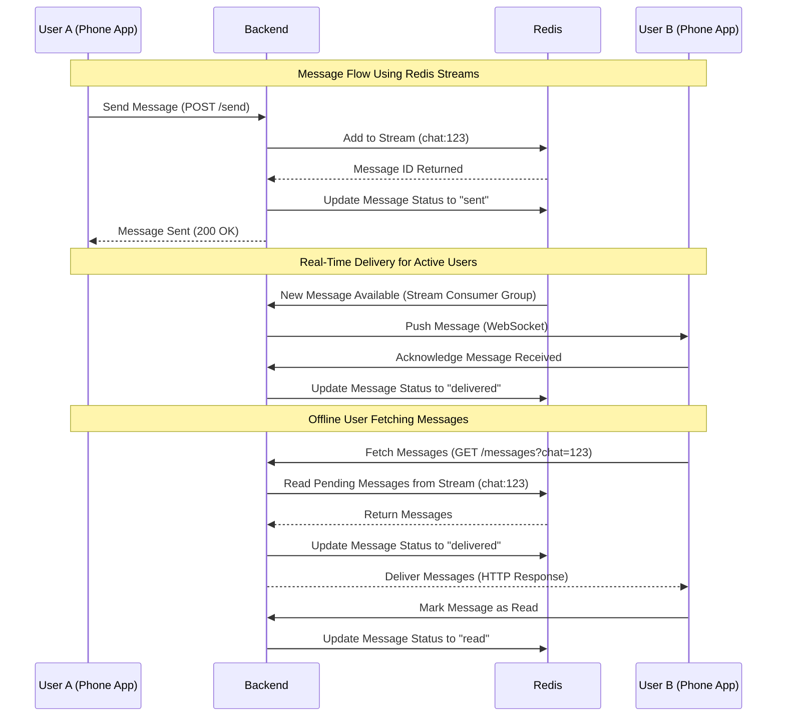

# Overview

This project is a sandbox for experimentation and learning,
designed to simulate the backend of a real-time messaging application.
It provides a simple framework to explore backend development concepts such as API design,
database interactions,
and system architecture.

The goal is to create a functional and flexible backend
that allows users to send and receive messages in private 1:1 chats while experimenting with new ideas and technologies.

# How to run

To check the available target from the Makefile, run the following command:

```bash
make help
```

You can run the project locally with debug logs by running the following command:

```bash
LOG_LEVEL=DEBUG go run ./cmd/main.go
```

# API

A [Bruno](https://www.usebruno.com/) collection is available in the `docs` folder.

## Register a User - POST /register

Register a new user.

```bash
curl -X POST http://localhost:8080/register \
-H "Content-Type: application/json" \
-d '{"phoneNumber": "+1234567890"}'
```

| Status Code                 | 	Description                                             |
|-----------------------------|----------------------------------------------------------|
| 201 (Created)               | User registered successfully.                            | 
| 400 (Bad Request)           | Invalid input (e.g., missing/invalid fields).            |
| 409 (Conflict)              | Phone number already registered.                         |
| 500 (Internal Server Error) | A server-side error occurs while processing the request. |

## Send a Message - POST /messages

send a new message.

```bash
curl -X POST http://localhost:8080/message \
-H "Content-Type: application/json" \
-d '{"sender": "+1234567890", "receiver": "+0987654321", "content": "Hello, World!"}'
```

| Status Code                 | 	Description                                             |
|-----------------------------|----------------------------------------------------------|
| 201 (Created)               | User registered successfully.                            | 
| 400 (Bad Request)           | Invalid input (e.g., missing/invalid fields).            |
| 404 (Not Found)             | The sender or recipient phone number does not exist.     |
| 500 (Internal Server Error) | A server-side error occurs while processing the request. |

## List Chats for a User - GET /chats?phoneNumber={phoneNumber}

List the chats for the provided phone number.

For the sake of simplicity, and security,
if the phone number is not provided, the API will return an empty list.
The number is passed as a query parameter but should be retrieved from the user token,
or in a way that does not expose it.

```bash
curl "http://localhost:8080/chats?phoneNumber=%2B3306666666"
```

| Status Code                 | 	Description                                             |
|-----------------------------|----------------------------------------------------------|
| 200 (ok)                    | return the list successfully.                            | 
| 400 (Bad Request)           | Invalid input (e.g., missing/invalid fields).            |
| 500 (Internal Server Error) | A server-side error occurs while processing the request. |

## List Messages for a Chat - GET /chats/{chat_id}/messages

Retrieve the messages for the specified chat.

For simplicity and clarity,
this endpoint uses a hierarchical structure to associate messages with a specific chat.
This approach avoids ambiguity and focuses on retrieving messages belonging to a single chat.

```bash
curl "http://localhost:8080/chats/3163f560-f246-4e68-8551-cb702f8a017a/messages"
```

| Status Code                 | 	Description                                             |
|-----------------------------|----------------------------------------------------------|
| 200 (ok)                    | return the list successfully.                            | 
| 400 (Bad Request)           | Invalid input (e.g., missing/invalid fields).            |
| 500 (Internal Server Error) | A server-side error occurs while processing the request. |

# Live Messages - Websocket /ws

To receive messages in real-time, you can establish a WebSocket connection to the server.
Then the server will push new messages to the client through the WebSocket connection.

To establish a WebSocket connection, send a GET request to the `/ws?userID={userID}` endpoint.

To send a message, send the following JSON payload:

```json
{
  "From":    "user1",
  "To":      "user2",
  "Content": "Hello, Jane!"
} 
```


# CI/CD

This project use Github Actions to run the CI/CD pipeline. The pipeline is defined in the `.github/workflows` folder.
There are several workflows defined in this project:
* test.yml: Run the tests
* validate.yml: Run the linters
* release.yml: Create a new release (changelog, tag, and release notes)
    * :warning: This GH Action use [conventional commit](https://www.conventionalcommits.org/en/v1.0.0/) to generate the changelog.

# Project Development Journey

## Step 1: Create the project structure and CI

The first step was to create the project structure and CI. As I used one of my existing project as a template, this step took around 30 min.

## Step 2: Create the API - register a user

* Then I started to implement the API. I started with the user API, as it is the most basic one.
  * I started to add a repository layer with a mongoDB implementation, but a realized that it was too much for this project at this step. So I decided to use a simple in-memory database.
  * I added some basic unit test to show how to test the API. I tried to not add too much tests, as the goal is to show how to test the API, not to test everything.
  * I added a bruno collection to show how to use it.
  * I added logs to have a better understanding of what is happening.

## Step 3: Create the API - send a message

I added the message API. I reused the same in-memory database to store the messages.

I keep the same line of thought as the user API, adding some basic unit tests to show how to test the API.

I face issue thinking about how to store the messages.
To keep it simple a decided to have a chat repository that is in charge of managing chat, which are discussions between two users.
Then, the chat ID is used to store the messages. In that way, we don't have to think in sender/receiver, just in chat.
This step is very naive too, but should be enough for the next step, which is listing the messages.

## Step 4: Create the API - list the chats for a user

Now that we can send messages, we need to list the chats for a user.
For this step, I added 
* a chat repository that is in charge of managing the chats.
* a chat handler that is in charge of managing the chat API.

I keep let the phoneNumber in the query parameter, but it should be in the token, or in a way that does not expose it.
We should use a pagination system to avoid returning all the chats at once.

## Step 5: Create the API - list the messages for a chats

I considered both `/chats/{chat_id}/messages` and `/messages?chat={chat_id}`.
I chose `/chats/{chat_id}/messages` for its simplicity and clarity.
This approach avoids confusion about which query parameters are available.
While the query-based path /messages?chat={chat_id} is more suited for searches or complex filtering,
the hierarchical path `/chats/{chat_id}/messages` aligns better with the current lifecycle of a chat app,
where the primary goal is to retrieve messages belonging to a specific chat.

For this step, I keep the same line of thought as the previous steps, and the in memory database.
We should have more tests, especially unit test on repositories to migrate to a real database.

## Step 6: Live messaging - get a message in real-time

I added a new endpoint to get the messages in real-time.
There are several ways to implement real-time messaging, such as WebSockets, Server-Sent Events, or polling.
Let's explore the different options and choose the best one for our use case.

| Feature                        | WebSockets            | SSE                   | Long Polling          | gRPC Streaming        | MQTT                  | Push Notifications    |
|--------------------------------|-----------------------|-----------------------|-----------------------|-----------------------|-----------------------|-----------------------|
| **Direction**                  | Bidirectional         | Server-to-client      | Server-to-client      | Bidirectional         | Bidirectional         | Server-to-client      |
| **Binary Support**             | Yes                  | No                    | No                    | Yes                  | Yes                  | No                    |
| **Reconnection Handling**      | Manual               | Automatic             | Automatic             | Built-in             | Built-in             | Built-in             |
| **Scalability**                | High                 | Moderate              | Low                   | High                 | High                 | Very High            |
| **Complexity**                 | Moderate             | Low                   | Low                   | High                 | Moderate             | Moderate             |
| **Best Use Case**              | Chat, games          | Notifications         | Basic notifications   | Microservices, chat  | IoT, lightweight chat| Offline notifications |

For a first implementation, I could have used Server-Sent Events (SSE) or Long Polling.
But, in a case of a chat application, and if we want something scalable, WebSockets or GRPC Streaming are more adapted.
As GRPC is more complex, I decided to use WebSockets.

So, the client must create a WebSocket connection to the server to receive messages in real-time.
Then, each time a message is sent, the server will push the message to the client through the WebSocket connection.

I hesitated between standard library and a library like gorilla/websocket.
Finally, I decided to use gorilla/websocket, as it is widely used.

# Next

We can improve the project in many ways. Here are some ideas (the order can be changed):

* Deploy a Real-Time Messaging System
  * Current API is based on polling, which is inefficient for real-time applications.
  * WebSockets or Server-Sent Events enable real-time communication.
* Replace the in-memory database with a real database.
  * In-memory data is ephemeral and will be lost when the server restarts.
  * Persisting data ensures reliability and scalability.
* Add Pagination for Chats and Messages
  * Retrieve messages and chats in smaller, more manageable chunks.
  * Improve performance and reduce the load on the server.
* Improve Validation and Error Handling
  * Ensure data integrity and a better user experience.
  * Prevent invalid input or edge cases (e.g., sending messages to non-existent phone numbers).
* Add Read/Delivered Message Status
  * Indicate when a message has been read or delivered.
  * Enhance the user experience and provide more context.
* Improve unit tests
  * Add more unit tests to cover edge cases and ensure code quality.
  * Use mocks and stubs to isolate components and improve test reliability.
* Add Integration Tests
  * Test the interaction between components (e.g., API endpoints, database).
  * Ensure the system works as expected in a real-world scenario.
* Implement Authentication and Authorization
  * Secure the API and prevent unauthorized access.
  * Use tokens, OAuth, or other authentication mechanisms.

## Database

We can use a real database to store the data. We can use MongoDB, PostgreSQL, or any other database.
We can use an ORM to simplify the database interactions.
Both options have their pros and cons, and the choice depends on the project requirements.
We can use Redis to store the messages, as it is a good fit for real-time messaging applications,
and use a relational database to store the users and chats.
This approach combines the strengths of both databases, but adds complexity to the system.
We can start with a single database and migrate to a more complex setup as needed.
The interest of Redis is to propose pub/sub or stream system to notify the user when a new message is received.

## Live Messaging

We can implement a real-time messaging system using WebSockets and Redis Stream.



I'm not familiar with Redis, so I don't know if it is the best solution for this use case,
but I'm very curious to learn more about it.

## API

We can imagine something more RESTful, like:

| Method | Path                                             | Body                                                                  | Response                                                                                 | Description                                                                                                                          |
|--------|--------------------------------------------------|-----------------------------------------------------------------------|------------------------------------------------------------------------------------------|--------------------------------------------------------------------------------------------------------------------------------------|
| POST   | /users                                           | {"phoneNumber": "+3306666666"}                                        | 201 Created                                                                              | Register a user by phone number.                                                                                                     |
| POST   | /chats                                           | {"participants":["+3306666666","+3307777777"]}                        | {"id":"bd065d0d", "participants":["+3306666666","+3307777777"]}                          | Create a new chat with a list of participants.                                                                                       |
| POST   | /messages                                        | {"chatId":"xxxxx", "sender":"+3306666666", "content":"Hello, World!"} | {"id":"bd065d0a", "chatId":"xxxxx", "sender":"+3306666666", "content":"Hello, World!"}   | Send a message to a chat.                                                                                                            |
| GET    | /chats?participant=+3306666666&limit=10&offset=0 |                                                                       | [{"id":"bd065d0b", "participants":["+3306666666","+3307777777"]}]                        | List all chats for a user, with optional pagination (limit and offset). With auth, the phone number can be retrieved from the token. |
| GET    | /chats/{chat_id}/messages?limit=10&offset=0      |                                                                       | [{"id":"bd065d0c", "chatId":"xxxxx", "sender":"+3306666666", "content":"Hello, World!"}] | List all messages for a chat, with optional pagination (limit and offset).                                                           |

This API impose to have a chat before sending a message, which is not the case in the current API.
IT is a constraint for a one to one chat, but it is more adapted for a group chat.
It is also more RESTful, as we have a chat resource, and a message resource.
We can also replace phone number by a user ID, which is more secure.

For the live messaging, we can add a WebSocket endpoint to listen to new messages, and endpoints to manage message status.

| Method | 	Path	                 | Body/Query	                                | Response	                                               | Description                                                                                           |
|--------|------------------------|--------------------------------------------|---------------------------------------------------------|-------------------------------------------------------------------------------------------------------|
| GET    | /ws	                   | token=<user_auth_token>                    | WebSocket connection	                                   | Establishes a WebSocket connection for real-time messaging.                                           |
| POST   | /messages              | 	{"chatId": "xxxxx", "content": "Hello!"}  | {"id": "bd065d0a", "timestamp": "2025-01-01T12:00:00Z"} | Send a message to a chat. This endpoint persists the message and optionally notifies connected users. |
| POST   | /chats/{chatId}/typing | 	{ "isTyping": true }                      | 200 OK	                                                 | Notify other participants in the chat that the user is typing.                                        |
| POST   | /chats/{chatId}/status | { "messageId": "xxxxx", "status": "read" } | 200 OK                                                  | Update the status of a message (e.g., delivered, read).                                               |
